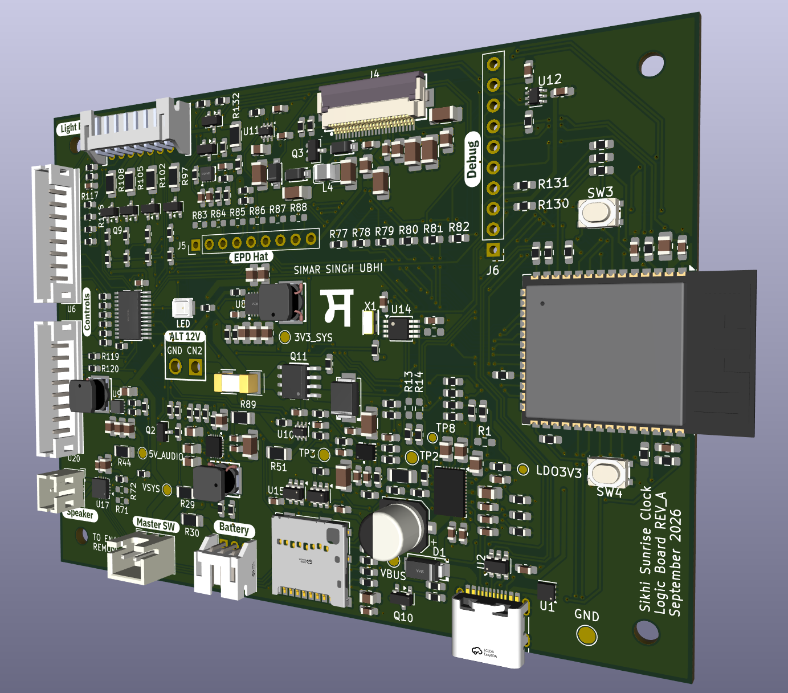
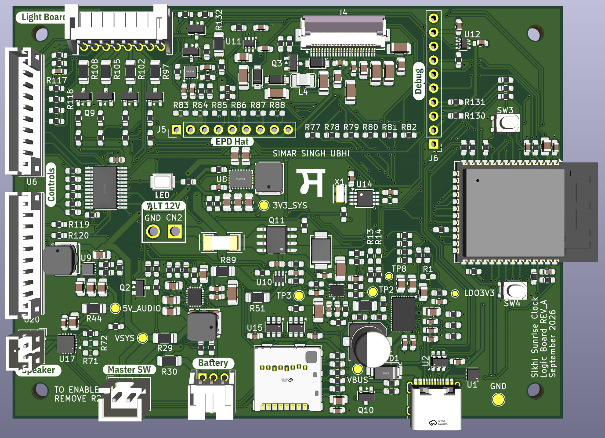
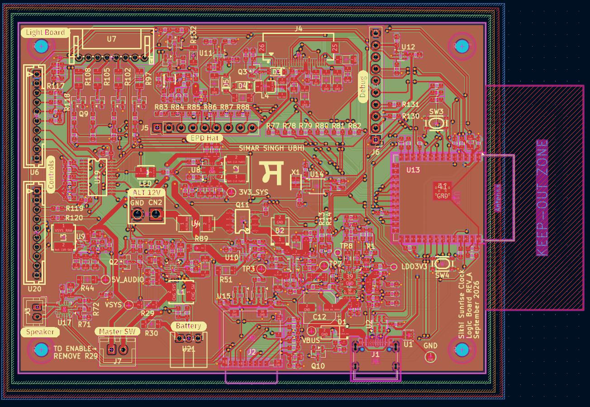
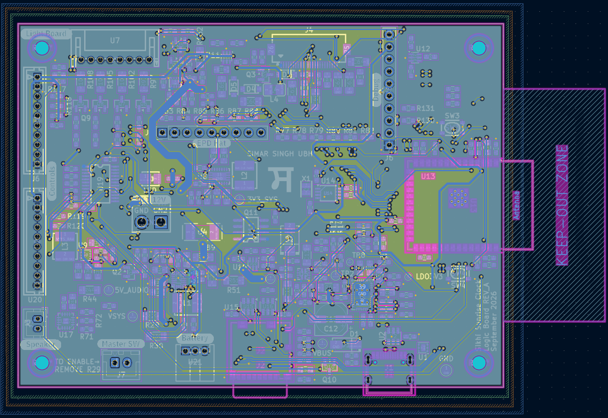
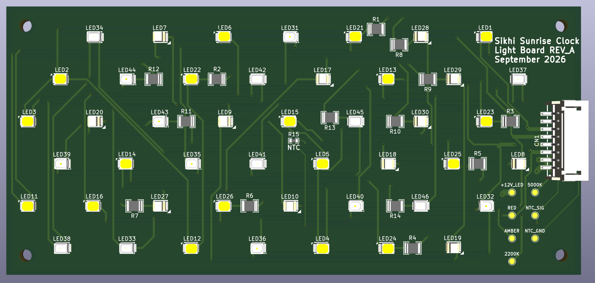
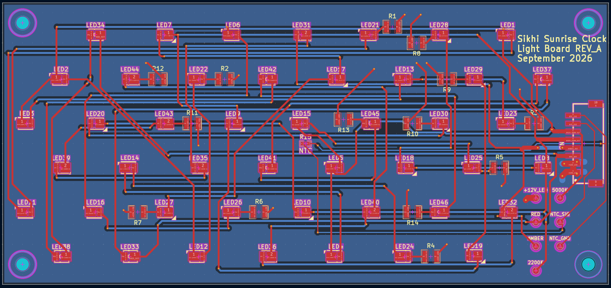
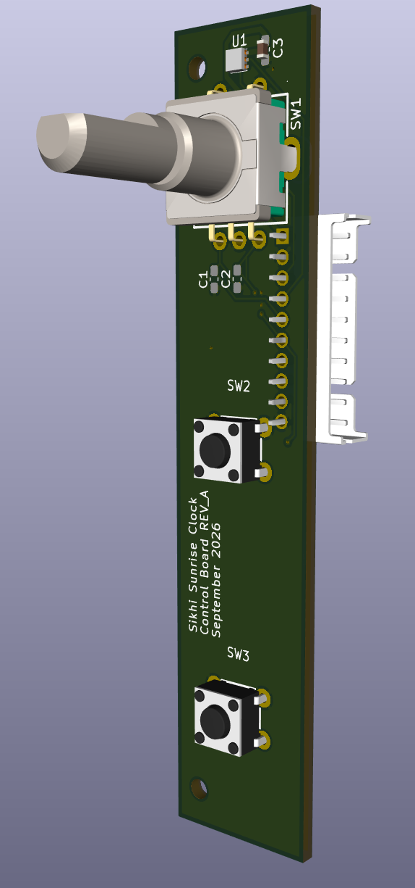

# Sikhi Sunrise Alarm Clock

I am designing a sunrise alarm clock to help me wake for [ਅੰਮ੍ਰਿਤ ਵੇਲਾ](https://www.sikhiwiki.org/index.php/Amritvela) and reduce my dependence on using a phone first thing in the morning. It combines a 5-inch e-paper display, programmable sunrise lighting, audio playback, physical controls, battery backup, and three custom PCBs in a standalone device that does not rely on a phone or cloud service for its core functions.

  

## Overview

The project is being developed as a complete standalone embedded system, from early requirements and block diagrams through power architecture, component selection, schematic design, PCB layout, mechanical planning, firmware, and hardware bring-up.

The hardware is split across three custom PCBs: a four-layer logic board, a dedicated light board, and a separate controls board. This keeps the main electronics, lighting, and physical interface modular and easier to develop independently.

## System Design

A few of the main design decisions were:

- ESP32-based main controller
- 5-inch e-paper display for a low-power, persistent interface
- local audio stored on a microSD card
- sunrise lighting on a dedicated 12 V light board
- separate 5 V rail for the audio system
- 3.3 V logic and digital interfaces
- battery backup for operation during a power interruption
- one USB-C connection for power, programming, and computer access
- rotary encoder and five physical buttons rather than relying on an app
- three separate PCBs so the controls, lighting, and main electronics can evolve independently

One feature I wanted from the beginning was easy access to the clock's audio and storage. The microSD card is internal, but the system is designed so the clock can be connected to a computer over USB-C to update stored audio and files without opening the enclosure or removing the card.

The firmware is planned to keep the core alarm, lighting, audio, and interface functions local while still taking advantage of the ESP32 where it makes sense. Future work includes Wi-Fi time synchronization, over-the-air firmware updates, and web API integration for Sikh calendar and event information.

## Logic Board

The logic board is the centre of the system. It handles the ESP32, power management, battery operation, display interface, audio, microSD storage, USB connectivity, controls, and communication with the light board.

  

### Power Architecture

The board has to support several different power requirements. The lighting system operates from 12 V, the audio system has a dedicated 5 V rail, and the ESP32 and other digital electronics operate at 3.3 V.

The power path includes USB-C power negotiation and input protection, battery charging and power-path management, power-source selection, a 3.3 V buck-boost regulator, and a separate 5 V boost stage for the audio system. Together, these stages allow the clock to transition between external power and battery operation while keeping the rest of the system on the rails it expects.

The four-layer layout was designed around these different power domains, with attention to grounding, power distribution, RF clearance, switching-regulator layout, debugging access, and separation between higher-power and more sensitive circuitry.

  

  

## Light Board

I separated the sunrise light from the logic board so that the lighting geometry, power, and diffuser could be designed around the enclosure rather than around the main electronics.

I also looked into what gives sunrise its colour rather than treating it as a simple RGB fade. At low sun angles, sunlight passes through more of the atmosphere, scattering more of the shorter blue wavelengths and allowing more of the warmer red and orange wavelengths to dominate the direct light [\[1\]](#ref-1). I also looked at commercial sunrise lights such as the Lumie Bodyclock Luxe 700FM, which uses separate red, orange, low-blue white, and blue-enriched white LEDs rather than relying on RGB mixing alone [\[2\]](#ref-2).

Based on that, the light board uses independently controlled red, amber, warm-white, and neutral-white channels. This gives me more control over the warm beginning of the sunrise sequence while still allowing the light to transition toward a more natural-looking white as it gets brighter.

The board operates from 12 V, with each lighting channel controlled independently so the firmware can shape both brightness and colour throughout the wake-up sequence.

  

  

## Controls Board

I wanted the clock to remain easy to use without reaching for a phone, so the main interface is completely physical: one rotary encoder and five buttons.

The controls are on their own PCB, and I placed the encoder and one of the buttons in the same location using separate, non-overlapping pad patterns. This gives me two possible control configurations from the same board without increasing the PCB size.

  

## Firmware

The firmware will tie the three boards together while keeping the core functionality local to the clock.

Planned functionality includes:

- alarm scheduling
- e-paper interface with English and Gurmukhi content
- gradual sunrise-light control
- audio playback from microSD
- rotary encoder and button input
- USB access to local storage
- battery and power-state management
- local settings and configuration
- Wi-Fi time synchronization
- web API integration for Sikh calendar and event information
- over-the-air firmware updates

The alarm, lighting, audio, and main interface will work without an app or internet connection. Wi-Fi will be used for features that benefit from it, such as time synchronization, calendar information, and firmware updates, rather than being required for everyday use.

## Current Status

Rev A of all three custom PCBs is complete, and the boards are now on the way for assembly and bring-up.

The next phase is first power-up and subsystem-by-subsystem testing. I plan to validate the power architecture first, then bring up the major interfaces individually before integrating the display, storage, audio, lighting, controls, battery operation, and firmware into the first complete MVP.

After the first successful MVP, I plan to build up to two additional units, depending on available parts, for a small beta-testing period with multiple users. This will give me up to three units in total and help validate the hardware and interface in everyday use before making decisions for the next revision.

## Future Improvements

The first revision is mainly about proving the complete system. Future revisions will focus on:

- reducing the overall enclosure and PCB size
- further optimizing electrical and firmware power consumption
- improving component placement for assembly, rework, and debugging
- refining the enclosure, diffuser, and overall mechanical integration
- simplifying assembly and future manufacturing
- applying what I learn from building and using the first physical prototype

## References

[1] [National Weather Service, _Why Is the Sky Blue?_](https://www.weather.gov/fgz/SkyBlue)

[2] [Lumie, _Bodyclock Luxe 700FM_.](https://www.lumie.com/products/bodyclock-luxe-700fm)

---

This repository is intended as a project showcase. Schematics, PCB source files, manufacturing files, detailed component information, and firmware source are kept private for the time being. Please contact me for more information if you are interested in the project!
